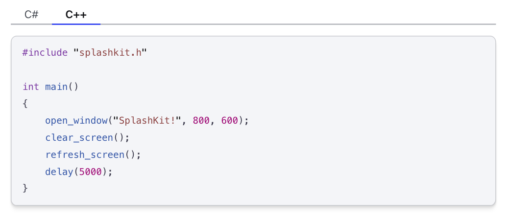

<!-- 
Note from Olivia:
Here is a bit of a style guide to ensure your files can be put into splashkit.io easily.
Update the CONTRIBUTING.md file to include content from here.
-->

## General

Make sure your tutorials follow the **markdownlint** (or similar) formatting.

Correct any yellow squiggly lines.

## Headings

Make sure to use the following **title** format:

```md
---
title: Tutorial Heading
---
```

Then use `## Heading` for the highest heading level.

Always keep a blank line between headings and other text.

### Subheadings

For subheadings that you want to see in the RHS sidebar/panel on splashkit.io, use `### Subheading`. Subheadings lower than this will not be shown.

Do not use bolded lines for headings/subheadings.

## Links

Do not use any "raw" links. Links must always use the following format:

```md
[Text to show for link](URL link)
```

Make sure to link your headings within the same file if these are mentioned, using the following format:

```md
[Heading text](#link-to-heading)
```

For the `#link-to-heading` part above, you should see a list appear with all of your headings. This will help to ensure the link will work on splashkit.io.

## Images

Always keep a blank line between images and other text.

Use the following format for all images:

```md

```

For the **Alt text** part above: Briefly explain what the image is showing. This is important for accessibility.

For the **link to image** part above: If you are linking an image resource that you have downloaded, this will need to be put into an **images** folder in the same place as the tutorial.  
For example, with the **skbox.png** image in the images folder here, you would use:

```md

```

Which would produce:


## Lists

Always keep a blank line between lists and other text.

## Code Blocks

Use fenced code blocks for any code snippets or terminal commands, to make it easier for the reader to copy.

Always include a language with the fenced code blocks.

### C# Code

For example, if using C#, you would use the following format:

````md
```csharp
using SplashKitSDK.SplashKit;

OpenWindow("SplashKit!", 800, 600);
ClearScreen();
RefreshScreen();
Delay(5000);
```
````

Which would produce:

```cs
using SplashKitSDK.SplashKit;

OpenWindow("SplashKit!", 800, 600);
ClearScreen();
RefreshScreen();
Delay(5000);
```

### C++ Code

For C++, you would use the following format:

````md
```cpp
#include "splashkit.h"

int main()
{
    open_window("SplashKit!", 800, 600);
    clear_screen();
    refresh_screen();
    delay(5000);
}
```
````

Which would produce:

```cpp
#include "splashkit.h"

int main()
{
    open_window("SplashKit!", 800, 600);
    clear_screen();
    refresh_screen();
    delay(5000);
}
```

For any blocks that are not code, you can use `text` for the language.

If your guide is only using 1 language (and not using at least both C# and C++), make sure to include the language used in the title.

### Multiple Code Languages

If you want to show the same code in different languages, you will need to use [Tabs](https://starlight.astro.build/guides/components/#tabs) and will need to create a `.mdx` file (rather than `.md`).

Make sure to add the following line to your file underneath the title:

```mdx
import { Tabs, TabItem } from "@astrojs/starlight/components";
```

And then using the examples from above, you would have:

```mdx
<Tabs>
    <TabItem label="C#">

    ```csharp
    using SplashKitSDK.SplashKit;

    OpenWindow("SplashKit!", 800, 600);
    ClearScreen();
    RefreshScreen();
    Delay(5000);
    ```

    </TabItem>
    
    <TabItem label="C++">

    ```cpp
    #include "splashkit.h"

    int main()
    {
        open_window("SplashKit!", 800, 600);
        clear_screen();
        refresh_screen();
        delay(5000);
    }
    ```

    </TabItem>
</Tabs>
```

The following images show what the different tabs would look like in an mdx file:




## Callouts (Asides)

Use callouts (also known as [Asides](https://starlight.astro.build/guides/components/#asides)) to highlight tips or important notes.

:::tip[Make the page interesting]
These can help to direct the reader to any extra info, and help to add more colour to your tutorial guide.
:::

<!-- TODO: Add other style guide tips -->
