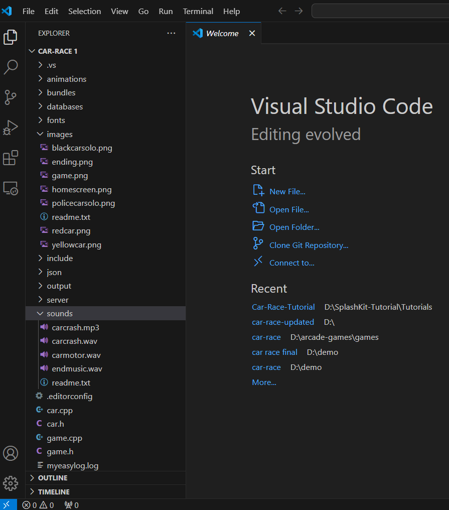
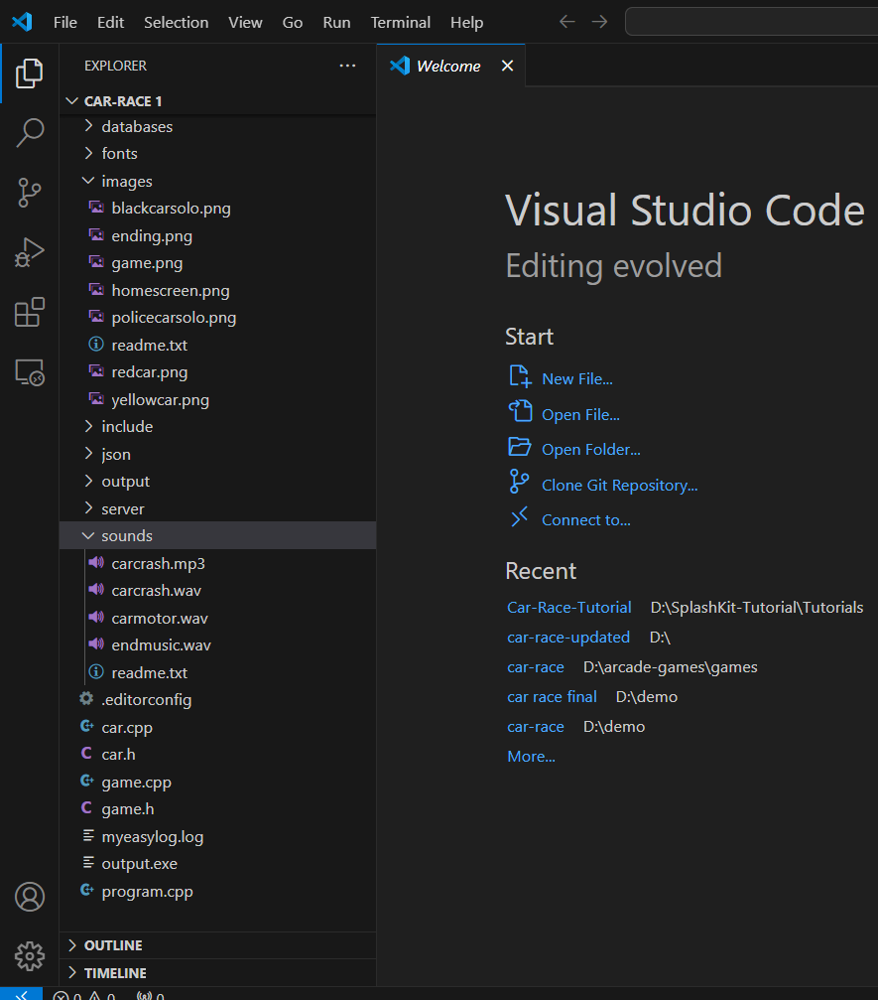

## Introduction

Welcome to the setup guide for SplashKit in preparation for developing the Car Race Game. SplashKit is a versatile game development toolkit that provides a wide range of features and functions to simplify the game development process. In this tutorial, we'll walk you through the steps to [install and configure SplashKit](https://splashkit.io/articles/installation/), set up your project, and get ready to start building your game.

### Installing SplashKit

To install SplashKit, follow these steps:

1. Visit the [SplashKit website](https://splashkit.io/articles/installation/) and find the installation guide for your operating system (Windows, macOS, or Linux).
2. Follow the instructions provid ed in the installation guide to download and install SplashKit on your computer.
3. Make sure to install any additional programs or libraries required by SplashKit as indicated in the installation guide.

### Creating Your Project

After installing SplashKit, it's time to create your Car Race Game project:

1. Create a new directory for your project on your computer. You can name it something like "CarRaceGame".
2. Use SplashKit Manager (SKM) to set up a new C++ project by running the command `skm new c++` in your project directory. This command initializes a new C++ project with SplashKit dependencies.
3. Generate resource folders for your project using the command `skm resources`. This command creates a "resources" folder where you can store game assets such as images, sounds, and fonts.
4. In this projet we have files car.cpp, game.cpp, car.h, game.h, and main program.cpp
5. The folder starting has libraries and then main files

### Configuring Your IDE

If you're using Visual Studio Code (VS Code) as your code editor:

1. Open VS Code and navigate to your project directory.
2. Set up your project configuration and compile your code using SKM commands in the VS Code terminal. You can use commands like `skm clang++ *.cpp -0 output` to compile your project and `./output.exe` to execute it.

## Conclusion

You've completed the setup process for SplashKit in preparation for developing the Car Race Game. With SplashKit installed and your project set up, you're ready to start coding and building your game. Stay tuned for the next tutorial where we'll dive into game development with SplashKit!

Happy coding!🚗💨
