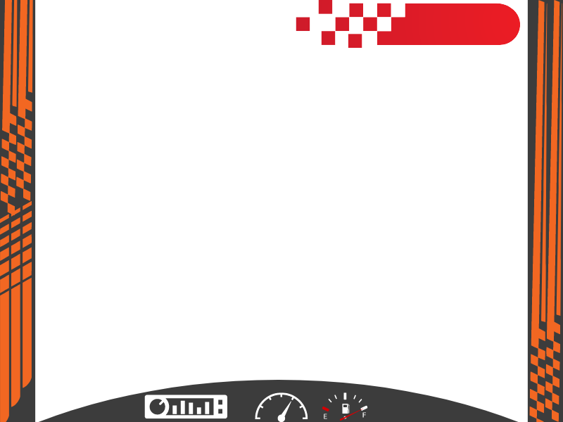

## Introduction

Welcome to the C++ Programming Concepts tutorial. In this tutorial, we'll cover fundamental C++ programming concepts and techniques, including functions, structures, enums, conditional statements, loops, and the usage of the standard library.

## Functions, Structures, and Enums

1. **Functions**:
   - Function is created and called as per the usage, here we have fucntions for every object and provide sample block of code for understanding. It performs specific task assigned. They ensure code reusability and organization
   - First the fucntions have been declared in header files and then the main files
   - Second we are using the fucntion and creating the car

     ```cpp
     
      // Function to get the bitmap for a car model
      bitmap car_bitmap(car_model model)

      // Function to create a new car
      car_data new_car(car_model model, double speed, double x, double y);

      // Function to switch the car's skin
      void switch_car_skin(car_data &car)

      // Function to draw the car
      void draw_car(car_data &car);

      // Function to update the car's position
      void update_car(car_data &car)

     ```

2. **Structures**:
   - Structures allow you to create custom data types that contain multiple variables.
   - Example structure definition:
   - Code for header files;

     ```cpp
     struct car_data
     {
       sprite car_sprite; // Sprite representing the car
       car_model model;   // Model of the car
       double speed;      // Speed of the car
     };

     ```

3. **Enums**:
   - Enums (enumerations) are user-defined data types consisting of named constants.
   - Example enum declaration:
   - These are also declared in header files

     ```cpp
     enum Color {
         RED,
         GREEN,
         BLUE
     };
     ```

## Standard Library Usage

1. **vector**:
   - The `<vector>` header provides a dynamic array implementation in C++, allowing flexible storage and manipulation of elements.
   - Example usage:

     ```cpp
     #include <vector>
     std::vector
     ```

2. **splashkit.h**:
   - Example usage:

     ```cpp
     #include "splashkit.h"
     ```

## Game Initialization

Initializing the game environment involves setting up necessary resources, such as images, sounds, and initial game state:

1. **Game State Setup**:

   Add the code to game.cpp file after handle user input

   - Create and initialize game data structures, such as player's car, obstacle cars, and score.
   - Example code snippet:

     ```cpp
     // Function to draw the game
     void draw_game(game_data &game)
     {
     clear_screen(COLOR_GRAY);

     for (int i = 0; i < 6; i++)
     {
        draw_sprite(game.whitemarks[i]);
     }

     for (int j = 0; j < game.cars.size(); j++)
     {
        draw_car(game.cars[j]);
     }

     draw_bitmap("game", 0, 0, option_to_screen());

     draw_text(to_string((int)game.score), COLOR_WHITE, "digi", 50, 650, 10, option_to_screen());
     draw_car(game.car);
     }
     ```



## Bitmap Loading and Manipulation

1. **Bitmap Loading**:
   - Load bitmap images from files:

     ```cpp
     // Used on many occassions
     draw_bitmap("game", 0, 0, option_to_screen()); // used while drawing the game
     bitmap default_bitmap = car_bitmap(model); // getting the car image
     ```

2. **Bitmap Manipulation**:
   - Modify bitmap properties such as size, color, and transparency:

     ```cpp
       bitmap_set_cell_details(default_bitmap, 75, 120, 3, 1, 3); // setting the car position
     ```

## Conclusion

Congratulations! You've learned essential C++ programming concepts, including functions, structures, enums, conditional statements, loops, and standard library usage. These concepts are foundational to writing efficient and maintainable C++ code.

Happy coding!🚗💨
