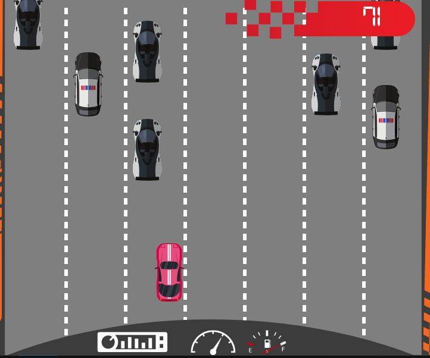
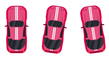
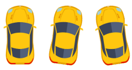

## Introduction

Welcome to the SplashKit Library Features tutorial. In this tutorial, we'll dive into the features offered by the SplashKit library, a powerful toolkit for game development in C++. We'll cover sprite creation, drawing, animation, bitmap loading, manipulation, sound effect loading, and playback.

## Sprite Creation, Drawing, and Animation

1. **Sprite Creation**:
   - Sprites are movable and animated images used to represent game objects.
   - Here we created the sprite to change the color of car skin
   - The code has been copied form car.cpp file for reference
   - Create a sprite from a bitmap:

     ```cpp
     void switch_car_skin(car_data &car)
     {
     bitmap other = car_bitmap(YELLOW);
     bitmap_set_cell_details(other, 75, 120, 3, 1, 3);
     sprite_add_layer(car.car_sprite, other, "YELLOW");
     sprite_hide_layer(car.car_sprite, 1);

     if (car.model == RED)
     {
        car.model = YELLOW;
        sprite_hide_layer(car.car_sprite, 0);
        sprite_show_layer(car.car_sprite, 1);
     }
     else if (car.model == YELLOW)
     {
        car.model = RED;
        sprite_hide_layer(car.car_sprite, 1);
        sprite_show_layer(car.car_sprite, 0);
     }
     }
     ```

2. **Drawing Sprites**:
   - The code has been copied form car.cpp file for reference
   - Draw a sprite on the screen:

     ```cpp
     // Function to draw the car
     void draw_car(car_data &car)
     {
     draw_sprite(car.car_sprite);
     }
     ```

3. **Animation**:
   - Animate a sprite by changing its position, rotation, and image frame over time:
   - While creating new car we declared the animation of the car

     ```cpp
     animation_script roadLineAnimation = load_animation_script("roadAnimation", "roadAnimation.txt");
     ```

## Car Models Creation

Make a car.cpp file and car.h file where user will start with basic libraries #include "splashkit.h" # include vector # include "car.h"
using namespace std; and then start with code where first part is bitmap loading.

1. **Car Bitmap Loading**:
   - Load bitmap images for different car models:
   - In this we made the fuction to call all the cars we are using in the game

     ```cpp
     bitmap car_bitmap(car_model model)
     {
     switch (model)
     {
     case RED:
        return bitmap_named("redcar");
     case YELLOW:
        return bitmap_named("yellowcar");
     case BLACK:
        return bitmap_named("blackcarsolo");
     case POLICE:
        return bitmap_named("policecarsolo");
     default:
        return bitmap_named("policecarsolo");
     }
     }
     ```

2. **Car Model Enumeration**:

 In header file user will start with basic libraries #ifndef CAR_RACE_CAR
 #define CAR_RACE_CAR

 #include "splashkit.h"
 #include vector and then start coding from enums

- Define an enumeration for different car models:

     ```cpp
     enum car_model {
     RED,
     YELLOW,
     BLACK,
     POLICE
     };
     ```

## Drawing and Updating Car Position

 In the same header file after enums user will add the code for struct

1. **Car Structure Definition**:
   - Define a structure to store car data:

     ```cpp
     struct car_data {
         sprite car_sprite; // sprite representing the car  
         car_model model;   // Model of the car
         double speed;     // Speed of the car
     };
     ```

2. **Car Creation**:

   In the car.cpp file now add create the car code after bitmap loading

   - Create a new car with specified model, speed, and position:

     ```cpp
     // Function to create a new car
     car_data new_car(car_model model, double speed, double x, double y)
     {
     car_data result;
     bitmap default_bitmap = car_bitmap(model);

     // Set cell details and animation script for RED and YELLOW cars
     if (model == RED || model == YELLOW)
     {
        bitmap_set_cell_details(default_bitmap, 75, 120, 3, 1, 3);
        animation_script carAnimation = load_animation_script("carAnimation", "carAnimation.txt");
        result.car_sprite = create_sprite(default_bitmap, carAnimation);
     }
     else
     {
        result.car_sprite = create_sprite(default_bitmap);
     }

     result.speed = speed;
     result.model = model;

     sprite_set_x(result.car_sprite, x);
     sprite_set_y(result.car_sprite, y);
     sprite_set_dy(result.car_sprite, result.speed);

     return result;
     }
     ```

3. **Drawing Car**:

   In the car.cpp file add the code after the switching car function

   - Draw the car sprite on the screen:

     ```cpp
     void draw_car(car_data &car)
     {
     draw_sprite(car.car_sprite);
     } 
     ```

4. **Updating Car Position**:

   In the car.cpp file add the code after the drawing car fucntion
   - The image states the car is running and updating its position.
   - Update the car's position based on its speed:

     ```cpp
     void update_car(car_data &car)
     {
     update_sprite(car.car_sprite);
     sprite_set_y(car.car_sprite, sprite_y(car.car_sprite) + car.speed);
     }
     ```

      

## Switching Car Skin During Gameplay

   Add the code to car.cpp after create a car function

1. **Switching Car Skin Function**:
   - Implement a function to switch the car's skin during gameplay:
   - The images are of the car which are used in code to change skin color of the car.

     ```cpp
     // Function to switch the car's skin
     void switch_car_skin(car_data &car)
     {
     bitmap other = car_bitmap(YELLOW);
     bitmap_set_cell_details(other, 75, 120, 3, 1, 3);
     sprite_add_layer(car.car_sprite, other, "YELLOW");
     sprite_hide_layer(car.car_sprite, 1);

     if (car.model == RED)
     {
        car.model = YELLOW;
        sprite_hide_layer(car.car_sprite, 0);
        sprite_show_layer(car.car_sprite, 1);
     }
     else if (car.model == YELLOW)
     {
        car.model = RED;
        sprite_hide_layer(car.car_sprite, 1);
        sprite_show_layer(car.car_sprite, 0);
     }
     }
     ```

      
      

2.**Handling User Input**:

   Add the code in gam.cpp file after randomly spawn obstacle cars

- Handle user input in the fucntion:

   ```cpp
      void handleInput(game_data &game)
      {
         if (key_down(A_KEY))
         {
            sprite_set_x(game.car.car_sprite, sprite_x(game.car.car_sprite) - 5);
            sprite_start_animation(game.car.car_sprite, "left");
         }
         else if (key_down(D_KEY))
         {
            sprite_set_x(game.car.car_sprite, sprite_x(game.car.car_sprite) + 5);
            sprite_start_animation(game.car.car_sprite, "right");
         }
         else if (key_typed(R_KEY))
         {
            switch_car_skin(game.car);
         }
         else
         {
            sprite_start_animation(game.car.car_sprite, "straight");
         }
      }
   ```

## Final Code for car.cpp

```cpp
   #include "splashkit.h"
   #include <vector>
   #include "car.h"
   using namespace std;

   // Function to get the bitmap for a car model
   bitmap car_bitmap(car_model model)
   {
      switch (model)
      {
      case RED:
        return bitmap_named("redcar");
      case YELLOW:
         return bitmap_named("yellowcar");
      case BLACK:
         return bitmap_named("blackcarsolo");
      case POLICE:
         return bitmap_named("policecarsolo");
      default:
         return bitmap_named("policecarsolo");
      }
   }

   // Function to create a new car
   car_data new_car(car_model model, double speed, double x, double y)
   {
      car_data result;
      bitmap default_bitmap = car_bitmap(model);

      // Set cell details and animation script for RED and YELLOW cars
      if (model == RED || model == YELLOW)
      {
         bitmap_set_cell_details(default_bitmap, 75, 120, 3, 1, 3);
         animation_script carAnimation = load_animation_script("carAnimation", "carAnimation.txt");
         result.car_sprite = create_sprite(default_bitmap, carAnimation);
      }
      else
      {
         result.car_sprite = create_sprite(default_bitmap);
      }

      result.speed = speed;
      result.model = model;

      sprite_set_x(result.car_sprite, x);
      sprite_set_y(result.car_sprite, y);
      sprite_set_dy(result.car_sprite, result.speed);

      return result;
   }

   // Function to switch the car's skin
   void switch_car_skin(car_data &car)
   {
      bitmap other = car_bitmap(YELLOW);
      bitmap_set_cell_details(other, 75, 120, 3, 1, 3);
      sprite_add_layer(car.car_sprite, other, "YELLOW");
      sprite_hide_layer(car.car_sprite, 1);

      if (car.model == RED)
      {
         car.model = YELLOW;
         sprite_hide_layer(car.car_sprite, 0);
         sprite_show_layer(car.car_sprite, 1);
      }
      else if (car.model == YELLOW)
      {
         car.model = RED;
         sprite_hide_layer(car.car_sprite, 1);
         sprite_show_layer(car.car_sprite, 0);
      }
   }

   // Function to draw the car
   void draw_car(car_data &car)
   {
      draw_sprite(car.car_sprite);
   }

   // Function to update the car's position
   void update_car(car_data &car)
   {
      update_sprite(car.car_sprite);
   }

```

## Final Code for car.h

```cpp
   #ifndef CAR_RACE_CAR
   #define CAR_RACE_CAR

   #include "splashkit.h"
   #include <vector>

   // Enumeration for different car models
   enum car_model
   {
      RED,
      YELLOW,
      BLACK,
      POLICE
   };

   // Structure to store car data
   struct car_data
   {
      sprite car_sprite; // Sprite representing the car
      car_model model;   // Model of the car
      double speed;      // Speed of the car
   };

   // Function to create a new car
   car_data new_car(car_model model, double speed, double x, double y);

   // Function to draw the car
   void draw_car(car_data &car);

   // Function to switch the car's skin
   void switch_car_skin(car_data &car);

   // Function to update the car's position
   void update_car(car_data &car);

   #endif
```

## Conclusion

Congratulations! You've explored the key features of the SplashKit library for game development. With SplashKit, you can create dynamic and engaging games with ease. Experiment with sprite creation, bitmap loading, sound effect playback, and more to bring your game ideas to life!

Happy game development!🚗💨
