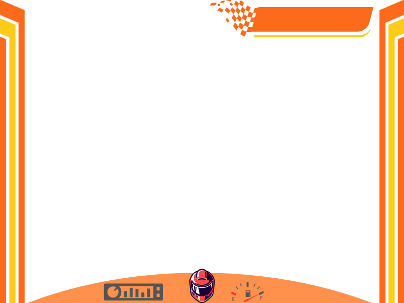
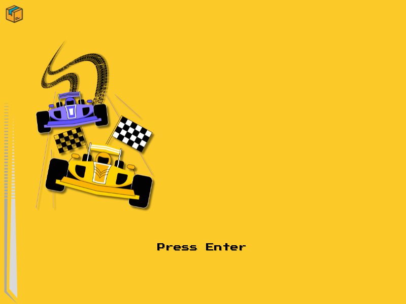
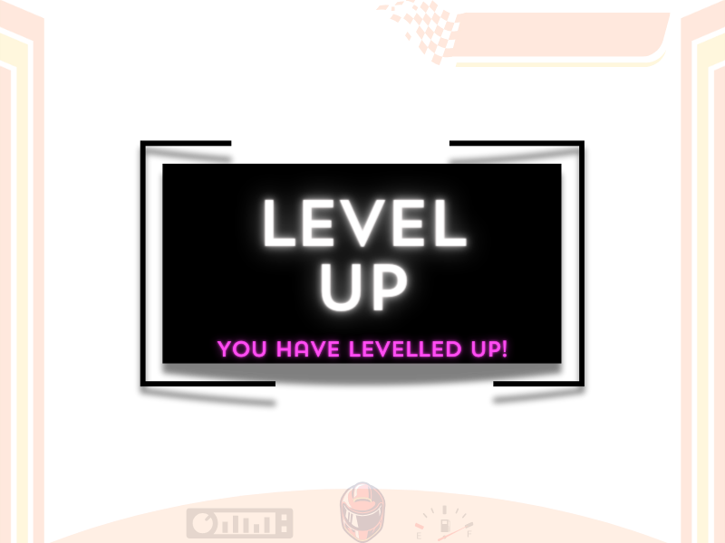

# Tutorial for Updated Car Race

 Important Notice : The previous car-racing need to be compiled successfully and working

 [Watch the Tutorial Video Of Updated Game](https://youtu.be/eWJ1rshG5yE)

## 1. New car.cpp

**Additions for Two Player Mode:** This update adds functionality to support a two-player mode in the game.

- **new_car function:** When creating a new car, it now also initializes a second player's car with a different color (YELLOW), positioned slightly to the right of the first player's car.

- **update_car function:** Updates the position of both player 1 and player 2 cars. If the game is paused (`game.paused` is true), it skips updating the cars.

```cpp
// Additions for Two Player Mode
car_data new_car(car_model model, double speed, double x, double y) {
    // ...
    result.secondPlayer = new_car(YELLOW, speed, x + 100, y);
    result.twoPlayer = true;
    // ...
}

void update_car(car_data &car) {
    // Pause the game if it's paused
    if (game.paused) return;

    // Update player 1 car
    update_sprite(car.car_sprite);

    // Update player 2 car
    if (car.twoPlayer) {
        update_sprite(car.secondPlayer.car_sprite);
    }
}
```


## Final Updated Code for car.cpp file

```cpp
    #include "splashkit.h"
    #include <vector>
    #include "car.h"
    using namespace std;

    // Function to get the bitmap for a car model
    bitmap car_bitmap(car_model model)
    {
        switch (model)
        {
        case RED:
            return bitmap_named("redcar");
        case YELLOW:
            return bitmap_named("yellowcar");
        case BLACK:
            return bitmap_named("blackcarsolo");
        case POLICE:
            return bitmap_named("policecarsolo");
        default:
            return bitmap_named("policecarsolo");
        }
    }

    // Function to create a new car
    car_data new_car(car_model model, double speed, double x, double y)
    {
        car_data result;
        bitmap default_bitmap = car_bitmap(model);

        // Set cell details and animation script for RED and YELLOW cars
        if (model == RED || model == YELLOW)
        {
            bitmap_set_cell_details(default_bitmap, 75, 120, 3, 1, 3);
            animation_script carAnimation = load_animation_script("carAnimation", "carAnimation.txt");
            result.car_sprite = create_sprite(default_bitmap, carAnimation);
        }
        else
        {
            result.car_sprite = create_sprite(default_bitmap);
        }

        result.speed = speed;
        result.model = model;

        sprite_set_x(result.car_sprite, x);
        sprite_set_y(result.car_sprite, y);
        sprite_set_dy(result.car_sprite, result.speed);

        return result;
    }

    // Function to switch the car's skin
    void switch_car_skin(car_data &car)
    {
        bitmap other = car_bitmap(YELLOW);
        bitmap_set_cell_details(other, 75, 120, 3, 1, 3);
        sprite_add_layer(car.car_sprite, other, "YELLOW");
        sprite_hide_layer(car.car_sprite, 1);

        if (car.model == RED)
        {
            car.model = YELLOW;
            sprite_hide_layer(car.car_sprite, 0);
            sprite_show_layer(car.car_sprite, 1);
        }
        else if (car.model == YELLOW)
        {
            car.model = RED;
            sprite_hide_layer(car.car_sprite, 1);
            sprite_show_layer(car.car_sprite, 0);
        }
    }

    // Function to draw the car
    void draw_car(car_data &car)
    {
        draw_sprite(car.car_sprite);
    }

    // Function to update the car's position
    void update_car(car_data &car)
    {
        update_sprite(car.car_sprite);
    }

```
## 2. Updating game.h

**Additions for Two Player Mode:** Extends the `game_data` structure to accommodate two-player mode.

- **secondPlayer:** Stores the data for the second player's car.
  
- **twoPlayer:** A boolean flag indicating whether the game is in two-player mode.
  
- **paused:** A boolean flag indicating whether the game is currently paused.
  
- **finished:** A boolean flag indicating whether the game has finished.
  
- **finish_line:** Stores the sprite for the finish line.

```cpp
// Additions for Two Player Mode
struct game_data {
    // ...
    car_data secondPlayer;
    bool twoPlayer;
    bool paused;
    bool finished;
    sprite finish_line;
};
```






## Final Code for game.h file 

```cpp
    #ifndef CAR_RACE_GAME
    #define CAR_RACE_GAME

    #include "splashkit.h"
    #include <vector>
    #include "car.h"
    #include "powerup.h"
    #include "barricade.h"
    // Structure to store game data
    struct game_data
    {
        bool game_over;           // Flag indicating if the game is over
        sprite whitemarks[6];     // Array of sprites for white marks on the road
        car_data car;             // Player's car
        vector<car_data> cars;    // Vector of obstacle cars
        double score;             // Current score
        vector<powerup_data> powerups; // Vector of powerups
        int level;                // Current level
        bool shield;              // Flag indicating if the player has a shield
        bool speed_boost;         // Flag indicating if the player has a speed boost
        vector<barricade_data> barricades; // Vector of barricades
        car_data secondPlayer;
        bool twoPlayer;
        bool paused;
        bool finished;
        sprite finish_line;
    };

    // Function to create a new game
    game_data new_game();

    // Function to draw the game
    void draw_game(game_data &game);

    // Function to update the game state
    void update_game(game_data &game);

    // Function to remove cars that have gone out of range
    void out_range(game_data &game);

    // Function to check for collisions between the player's car and obstacle cars
    void check_collisions(game_data &game);

    // check_collisions_barricade(game);
    void check_collisions_barricade(game_data &game);
    //    check_collisions_powerup(game);
    void check_collisions_powerup(game_data &game);
    #endif

```

## 3. New powerup.cpp

- powerup_bitmap Function: This function takes a powerup_type enum as input and returns the corresponding bitmap for the given powerup type. It uses a switch statement to select the appropriate bitmap based on the powerup type.

- new_powerup Function: This function creates a new powerup with the specified type, speed, and position (x, y). It initializes a sprite for the powerup using the powerup_bitmap function, sets its position, type, and speed, and returns the resulting powerup_data structure.

- draw_powerup Function: This function draws the powerup sprite on the screen.

- update_powerup Function: This function updates the position of the powerup sprite by moving it vertically downwards based on its speed.

- out_range_powerup Function: This function removes powerups from the vector powerups that have gone out of the visible range of the screen. It iterates through the vector and checks the y-coordinate of each powerup sprite. If it exceeds a certain threshold (600 in this case), the powerup is removed from the vector.

```cpp
#include "splashkit.h"
#include <vector>
#include "powerup.h"

int main()
{
    // Initialize SplashKit
    open_window("Powerup Demo", 800, 600);
    load_resource_bundle("powerup_bundle", "powerup_bundle.txt");

    // Create a vector to store powerups
    std::vector<powerup_data> powerups;

    // Add some powerups to the vector
    powerups.push_back(new_powerup(SHIELD, 5, 100, 100));
    powerups.push_back(new_powerup(SPEED_BOOST, 3, 200, 200));
    powerups.push_back(new_powerup(COIN, 4, 300, 300));

    // Main game loop
    while (not quit_requested())
    {
        // Update powerups
        for (auto &powerup : powerups)
        {
            update_powerup(powerup);
        }

        // Clear the screen
        clear_screen(COLOR_WHITE);

        // Draw powerups
        for (auto &powerup : powerups)
        {
            draw_powerup(powerup);
        }

        // Remove out-of-range powerups
        out_range_powerup(powerups);

        // Refresh the screen
        refresh_screen();
        delay(17); // Cap the frame rate to approximately 60 frames per second
    }

    // Close SplashKit
    close_window("Powerup Demo");
    return 0;
}

```


## Final Code for Powerup.cpp file 

```cpp
    #include "splashkit.h"
    #include <vector>
    #include "powerup.h"


    bitmap powerup_bitmap(powerup_type type)
    {
        switch (type)
        {
        case SHIELD:
            return bitmap_named("shield");
        case SPEED_BOOST:
            return bitmap_named("speedup");
        case SLOW_DOWN:
            return bitmap_named("slowdown");
        case COIN:
            return bitmap_named("coin");
        default:
            return bitmap_named("coin");
        }
        
    }
    // Function to create a new powerup
    powerup_data new_powerup(powerup_type type, double speed, double x, double y)
    {
        powerup_data result;
        //random powerup
        // powerup_type type = static_cast<powerup_type>(rand() % 3);
        result.powerup_sprite = create_sprite(powerup_bitmap(type));
    
        sprite_set_x(result.powerup_sprite, x);
        sprite_set_y(result.powerup_sprite, y);
        result.type = type;
        result.speed = speed;
        return result;
    }

    // Function to draw the powerup
    void draw_powerup(powerup_data &powerup)
    {
        draw_sprite(powerup.powerup_sprite);
    }

    // Function to update the powerup's position
    void update_powerup(powerup_data &powerup)
    {
        sprite_set_y(powerup.powerup_sprite, sprite_y(powerup.powerup_sprite) + powerup.speed);
    }

    // Function to remove powerups that have gone out of range
    void out_range_powerup(std::vector<powerup_data> &powerups)
    {
        for (int j = 0; j < powerups.size(); j++)
        {
            if (sprite_y(powerups[j].powerup_sprite) > 600)
            {
                // Remove the element from the vector
                powerups.erase(powerups.begin() + j);
                // Decrement j to account for the removed element
                j--;
            }
        }
    }
```

## 5. New powerup.h

- The explanation of code as follows :
- powerup.h defines the structure and functions related to powerups in the game.
- powerup_data struct stores data for each powerup, including its sprite, type, and speed.
- The powerup_type enum lists different types of powerups available in the game.
- new_powerup function creates a new powerup with the specified type, speed, and position.
- draw_powerup function draws the powerup sprite on the screen.
- update_powerup function updates the powerup's position based on its speed.
- out_range_powerup function removes powerups that have gone out of range from the screen.

```cpp
// Enumeration for different powerups
enum powerup_type
{
    SHIELD,
    SPEED_BOOST,
    SLOW_DOWN,
    COIN
};

// Structure to store powerup data
struct powerup_data
{
    sprite powerup_sprite; // Sprite representing the powerup
    powerup_type type;     // Type of the powerup
    double speed;          // Speed of the powerup
};

// Function to create a new powerup
powerup_data new_powerup(powerup_type type, double speed, double x, double y);

// Function to draw the powerup
void draw_powerup(powerup_data &powerup);

// Function to update the powerup's position
void update_powerup(powerup_data &powerup);

// Function to remove powerups that have gone out of range
void out_range_powerup(std::vector<powerup_data> &powerups);

#endif
```
## Final Code for Powerup.h

```cpp
    #ifndef POWER_UP
    #define POWER_UP

    #include "splashkit.h"
    #include <vector>

    // Enumeration for different powerups
    enum powerup_type
    {
        SHIELD,
        SPEED_BOOST,
        SLOW_DOWN,
        COIN
    };

    // Structure to store powerup data
    struct powerup_data
    {
        sprite powerup_sprite; // Sprite representing the powerup
        powerup_type type;     // Type of the powerup
        double speed;          // Speed of the powerup
    };

    // Function to create a new powerup
    powerup_data new_powerup(powerup_type type, double speed, double x, double y);

    // Function to draw the powerup
    void draw_powerup(powerup_data &powerup);

    // Function to update the powerup's position
    void update_powerup(powerup_data &powerup);

    // Function to remove powerups that have gone out of range
    void out_range_powerup(std::vector<powerup_data> &powerups);

    #endif
```

## 6. New barricade.cpp

- Header Inclusions: Includes necessary headers such as "splashkit.h" for SplashKit functionalities and vector for vector data structure.
- Constants and Variables: Defines constants like gap_size and an array gap_locations to store possible positions for gaps in the barricades. previous_gap_location is initialized to an invalid value to ensure that the first gap location is chosen randomly.
- get_new_gap_location Function: Generates a random index to select a gap location from the gap_locations array, ensuring that the same gap location is not chosen consecutively.
- barricade_bitmap Function: Creates a bitmap representing a barricade with a gap. It selects a random gap location, draws the left and right parts of the barricade around the gap, sets up collision masks, and returns the resulting bitmap.
- new_barricade Function: Creates a new barricade with the specified speed and y-coordinate. It initializes a sprite using the bitmap generated by barricade_bitmap and sets its position and speed.
- draw_barricade Function: Draws the barricade sprite on the screen.
- update_barricade Function: Updates the position of the barricade sprite.
- out_range_barricade Function: Removes barricades from the vector barricades that have gone out of the visible range of the screen.

```cpp
// Define constants
#define gap_size 100
double gap_locations[] = {250, 300, 350, 400, 450, 500, 550};
double previous_gap_location = -1;

// Function to get a new random gap location
double get_new_gap_location()
{
    int index;
    do
    {
        index = rand() % 7;
    } while (gap_locations[index] == previous_gap_location);

    previous_gap_location = gap_locations[index];
    return gap_locations[index];
}

// Function to create a bitmap for a barricade with a gap
bitmap barricade_bitmap()
{
    bitmap barricade_bitmap = create_bitmap("barricade3", 750, 40);
    double gap_location = get_new_gap_location();

    draw_bitmap_on_bitmap(barricade_bitmap, bitmap_named("barricade2"), 0, 0, option_part_bmp(0, 0, gap_location, 40));
    draw_bitmap_on_bitmap(barricade_bitmap, bitmap_named("barricade2"), gap_location + gap_size, 0, option_part_bmp(gap_location + gap_size, 0, 700 - gap_location - gap_size, 40));
    
    setup_collision_mask(barricade_bitmap);
    return barricade_bitmap;
}

// Function to create a new barricade
barricade_data new_barricade(double speed, double y)
{
    barricade_data result;
    result.barricade_sprite = create_sprite(barricade_bitmap());
    sprite_set_x(result.barricade_sprite, 50);
    sprite_set_y(result.barricade_sprite, y);
    sprite_set_dy(result.barricade_sprite, speed);
    return result;
}

// Function to draw the barricade
void draw_barricade(barricade_data &barricade)
{
    draw_sprite(barricade.barricade_sprite);
}

// Function to update the barricade's position
void update_barricade(barricade_data &barricade)
{
    update_sprite(barricade.barricade_sprite);
}

// Function to remove barricades that have gone out of range
void out_range_barricade(std::vector<barricade_data> &barricades)
{
    for (int j = 0; j < barricades.size(); j++)
    {
        if (sprite_y(barricades[j].barricade_sprite) > 600)
        {
            barricades.erase(barricades.begin() + j);
            j--;
        }
    }
}
```


## Final Code for Baricade.cpp

```cpp
    #include "splashkit.h"
    #include <vector>
    #include "barricade.h"

    #define gap_size 150
    double gap_locations[] = {250, 300, 350, 400, 450, 500, 550};
    double previous_gap_location = -1; // Initialize to an invalid value

    double get_new_gap_location()
    {
        int index;
        do
        {
            index = rand() % 7; // Generate a random index between 0 and 3
        } while (gap_locations[index] == previous_gap_location);

        previous_gap_location = gap_locations[index];
        return gap_locations[index];
    }

    // Function to get the bitmap for a barricade
    bitmap barricade_bitmap()
    {
        // Adjust the gap size as needed
        bitmap barricade_bitmap = create_bitmap("barricade3", 750, 40); // Adjust the size of the barricade as needed

        // get random location between 50 and 650

        double gap_location = get_new_gap_location();
        // write_line("gap location: " + std::to_string(gap_location));
        // Draw the left part of the barricade
        draw_bitmap_on_bitmap(barricade_bitmap, bitmap_named("barricade2"), 0, 0, option_part_bmp(0, 0, gap_location, 40));

        // Draw the right part of the barricade
        draw_bitmap_on_bitmap(barricade_bitmap, bitmap_named("barricade2"), gap_location + gap_size, 0, option_part_bmp(gap_location + gap_size, 0, 700 - gap_location - gap_size, 40));
        //setup_collision_mask(bitmap bmp)
        setup_collision_mask(barricade_bitmap);

        // save_bitmap(barricade_bitmap, "barricade2");
        return barricade_bitmap;
    }

    // Function to create a new barricade
    barricade_data new_barricade(double speed, double y)
    {
        barricade_data result;
        // bitmap bitmap_with_gap = barricade_bitmap();
        result.barricade_sprite = create_sprite(barricade_bitmap());
        sprite_set_x(result.barricade_sprite, 50);
        sprite_set_y(result.barricade_sprite, y);

        result.speed = speed;
        sprite_set_dy(result.barricade_sprite, speed);
        return result;
    }

    // Function to draw the barricade
    void draw_barricade(barricade_data &barricade)
    {

        draw_sprite(barricade.barricade_sprite);
    }

    // Function to update the barricade's position
    void update_barricade(barricade_data &barricade)
    {
        update_sprite(barricade.barricade_sprite);
    }

    // Function to remove barricades that have gone out of range
    void out_range_barricade(std::vector<barricade_data> &barricades)
    {
        for (int j = 0; j < barricades.size(); j++)
        {
            if (sprite_y(barricades[j].barricade_sprite) > 600)
            {
                // Remove the element from the vector
                barricades.erase(barricades.begin() + j);
                // Decrement j to account for the removed element
                j--;
            }
        }
    }
    // #endif
```

## 7. New barricade.h

- The explanation of code as follows :
- barricade.h defines the structure and functions related to barricades in the game.
- barricade_data struct stores data for each barricade, including its sprite, speed, and gap location.
- new_barricade function creates a new barricade with the specified speed and initial position.
- draw_barricade function draws the barricade sprite on the screen.
- update_barricade function updates the barricade's position based on its speed.
- out_range_barricade function removes barricades that have gone out of range from the screen.

```cpp
#ifndef BARRICADE
#define BARRICADE

#include "splashkit.h"
#include <vector>

// Structure to store barricade data
struct barricade_data
{
    sprite barricade_sprite; // Sprite representing the barricade
    double speed;            // Speed of the barricade
    double gap_location;     // Location of the gap in the barricade
};

// Function to create a new barricade
barricade_data new_barricade(double speed, double y);

// Function to draw the barricade
void draw_barricade(barricade_data &barricade);

// Function to update the barricade's position
void update_barricade(barricade_data &barricade);

// Function to remove barricades that have gone out of range
void out_range_barricade(std::vector<barricade_data> &barricades);

#endif

```

## Final Code for Barricade.h

```cpp
    #ifndef BARRICADE
    #define BARRICADE

    #include "splashkit.h"
    #include <vector>

    // Structure to store barricade data
    struct barricade_data
    {
        sprite barricade_sprite; // Sprite representing the barricade
        double speed;            // Speed of the barricade
        double gap_location;     // Location of the gap in the barricade
    };

    // Function to create a new barricade
    barricade_data new_barricade(double speed, double y);

    // Function to draw the barricade
    void draw_barricade(barricade_data &barricade);

    // Function to update the barricade's position
    void update_barricade(barricade_data &barricade);

    // Function to remove barricades that have gone out of range
    void out_range_barricade(std::vector<barricade_data> &barricades);

    #endif
```

## 8. Conclusion

In conclusion, these code files provide a foundation for creating a dynamic and engaging car racing game with features such as multiple car models, powerups, obstacles, and two-player mode. By utilizing SplashKit's functionality and these code structures, developers can easily extend and customize the game to suit their preferences and requirements.
