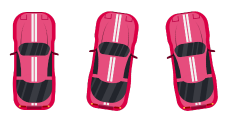

## Introduction

Welcome to the Car Handling tutorial with SplashKit. In this tutorial, we'll explore how to handle cars in your game using the features provided by the SplashKit library. We'll cover the creation of different car models, drawing and updating car positions, switching car skins and collision detection during gameplay.

## Car Models Creation

Make a car.cpp file and car.h file where user will start with basic libraries #include "splashkit.h"
#include <vector>
#include "car.h"
using namespace std; and then start with code where first part is bitmap loading.

1. **Car Bitmap Loading**:
   - Load bitmap images for different car models:
   - In this we made the fuction to call all the cars we are using in the game
     ```cpp
     bitmap car_bitmap(car_model model)
     {
     switch (model)
     {
     case RED:
        return bitmap_named("redcar");
     case YELLOW:
        return bitmap_named("yellowcar");
     case BLACK:
        return bitmap_named("blackcarsolo");
     case POLICE:
        return bitmap_named("policecarsolo");
     default:
        return bitmap_named("policecarsolo");
     }
     }
     ```

2. **Car Model Enumeration**:

 In header file user will start with basic libraries #ifndef CAR_RACE_CAR
 #define CAR_RACE_CAR

 #include "splashkit.h"
 #include <vector> and then start coding from enums 

   - Define an enumeration for different car models:
     ```cpp
     enum car_model {
     RED,
     YELLOW,
     BLACK,
     POLICE
     };
     ```

## Drawing and Updating Car Position

 In the same header file after enums user will add the code for struct

1. **Car Structure Definition**:
   - Define a structure to store car data:
     ```cpp
     struct car_data {
         sprite car_sprite; // sprite representing the car  
         car_model model;   // Model of the car
         double speed;     // Speed of the car
     };
     ```

2. **Car Creation**:

   In the car.cpp file now add create the car code after bitmap loading

   - Create a new car with specified model, speed, and position:
     ```cpp
     // Function to create a new car
     car_data new_car(car_model model, double speed, double x, double y)
     {
     car_data result;
     bitmap default_bitmap = car_bitmap(model);

     // Set cell details and animation script for RED and YELLOW cars
     if (model == RED || model == YELLOW)
     {
        bitmap_set_cell_details(default_bitmap, 75, 120, 3, 1, 3);
        animation_script carAnimation = load_animation_script("carAnimation", "carAnimation.txt");
        result.car_sprite = create_sprite(default_bitmap, carAnimation);
     }
     else
     {
        result.car_sprite = create_sprite(default_bitmap);
     }

     result.speed = speed;
     result.model = model;

     sprite_set_x(result.car_sprite, x);
     sprite_set_y(result.car_sprite, y);
     sprite_set_dy(result.car_sprite, result.speed);

     return result;
     }
     ```

3. **Drawing Car**:

   In the car.cpp file add the code after the switching car function

   - Draw the car sprite on the screen:
     ```cpp
     void draw_car(car_data &car)
     {
     draw_sprite(car.car_sprite);
     } 
     ```

4. **Updating Car Position**:

   In the car.cpp file add the code after the drawing car fucntion 

   - Update the car's position based on its speed:
     ```cpp
     void update_car(car_data &car)
     {
     update_sprite(car.car_sprite);
     sprite_set_y(car.car_sprite, sprite_y(car.car_sprite) + car.speed);
     }
     ```


## Switching Car Skin During Gameplay

   Add the code to car.cpp after create a car function

1. **Switching Car Skin Function**:
   - Implement a function to switch the car's skin during gameplay:
     ```cpp
     // Function to switch the car's skin
     void switch_car_skin(car_data &car)
     {
     bitmap other = car_bitmap(YELLOW);
     bitmap_set_cell_details(other, 75, 120, 3, 1, 3);
     sprite_add_layer(car.car_sprite, other, "YELLOW");
     sprite_hide_layer(car.car_sprite, 1);

     if (car.model == RED)
     {
        car.model = YELLOW;
        sprite_hide_layer(car.car_sprite, 0);
        sprite_show_layer(car.car_sprite, 1);
     }
     else if (car.model == YELLOW)
     {
        car.model = RED;
        sprite_hide_layer(car.car_sprite, 1);
        sprite_show_layer(car.car_sprite, 0);
     }
     }
     ```




2. **Handling User Input**:

   Add the code in gam.cpp file after randomly spawn obstacle cars

   - Handle user input in the fucntion:
     ```cpp
     void handleInput(game_data &game)
     {
     if (key_down(LEFT_KEY)) {
        // Move car left
        sprite_set_x(game.car.car_sprite, sprite_x(game.car.car_sprite) - 11);
        sprite_start_animation(game.car.car_sprite, "left");
     } else if (key_down(RIGHT_KEY)) {
        // Move car right
        sprite_set_x(game.car.car_sprite, sprite_x(game.car.car_sprite) + 11);
        sprite_start_animation(game.car.car_sprite, "right");
     } else if (key_down(UP_KEY)) {
        game.car.speed -= 0.2;
        // Enforce speed limit
        if (game.car.speed > MAX_PLAYER_SPEED) {
            game.car.speed = MAX_PLAYER_SPEED;
        }
     } else if (key_down(DOWN_KEY)) {
        game.car.speed += 0.5;
        // Enforce speed limit
        if (game.car.speed > MAX_PLAYER_SPEED) {
            game.car.speed = MAX_PLAYER_SPEED;
        }
     } else if (key_typed(R_KEY)) {
        // Restart
        game_started = false; // Assuming you have a 'game_started' flag
        game = new_game(); // Reset the game
     } else if (key_typed(Q_KEY)) {
        // END PROGRAM
        exit(0);
     } else if (key_typed(C_KEY)) {
        // Switch car skin
        switch_car_skin(game.car);
     }
     {


        sprite_start_animation(game.car.car_sprite, "straight");
     }
     }
     ```

## Collision Detection

Add the code to the game.cpp after function to remove cars that have gone out of range

Collision detection is crucial for handling interactions between game objects:

1. **Basic Collision Detection**:
   - Detect collisions between sprites based on their bounding boxes or custom shapes.
   - Example code snippet:
     ```cpp
     void check_collisions(game_data &game)
     {
     for (int i = 0; i < game.cars.size(); i++)
     {
        if (sprite_collision(game.car.car_sprite, game.cars[i].car_sprite))
        {
            play_sound_effect("carcrash", 1);
            delay(400);
            game.game_over = true;
        }
     }
     }
     ```

## Flow Chart 


## Conclusion

Congratulations! You've learned how to handle cars in your game using the SplashKit library. Experiment with different car models, customize their appearance, and enhance your gameplay experience. Keep practicing and exploring the possibilities to create amazing car-themed games!

Happy game development!🚗💨
