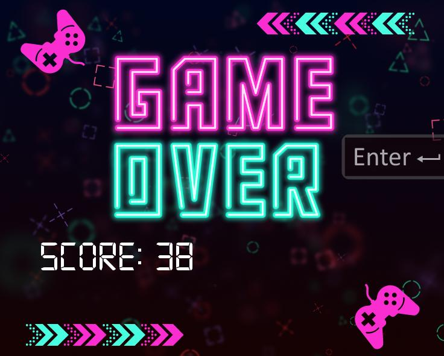

## Introduction

Welcome to the Game Management tutorial with SplashKit. In this tutorial, we'll cover essential concepts and techniques for managing game initialization, user input, obstacle spawning, score tracking, game over conditions, and audio features.

## Game Initialization

Initializing the game environment involves setting up necessary resources, such as images, sounds, and initial game state:

1. **Game State Setup**:
    
   Add the code to game.cpp file after handle user input

   - Create and initialize game data structures, such as player's car, obstacle cars, and score.
   - Example code snippet:
     ```cpp
     // Function to draw the game
     void draw_game(game_data &game)
     {
     clear_screen(COLOR_GRAY);

     for (int i = 0; i < 6; i++)
     {
        draw_sprite(game.whitemarks[i]);
     }

     for (int j = 0; j < game.cars.size(); j++)
     {
        draw_car(game.cars[j]);
     }

     draw_bitmap("game", 0, 0, option_to_screen());

     draw_text(to_string((int)game.score), COLOR_WHITE, "digi", 50, 650, 10, option_to_screen());
     draw_car(game.car);
     }
     ```


## Obstacle Spawning and Updating the game state

Spawn and update obstacle cars to create challenging gameplay:

1. **Random Obstacle Spawning**:

   In game.cpp after map setup add the code 

   - Randomly spawn obstacle cars at predefined intervals or positions.
   - Example code snippet:
     ```cpp
     // Function to randomly spawn obstacle cars
     void randomCars(game_data &game)
     {
     int xLocations[] = {50, 150, 250, 350, 450, 550, 650}; // Array to store the x locations
     car_model carModels[] = {POLICE, BLACK};               // Array of car models

     // Randomly select x locations for the cars
     for (int i = 0; i < CARS_COUNT; i++)
     {
     int randomIndex = rand() % CARS_COUNT; // Generate a random index between 0 and 6
     int x = xLocations[randomIndex];
     car_model model = carModels[rand() % 2]; // Randomly select a car model
     int speed = random_range(MIN_SPEED, MAX_SPEED); // Randomly select a speed
     car_data laner_cars = new_car(model, speed, x, -300); // Create a car sprite at the selected x location
     game.cars.push_back(laner_cars); // Add the car to the game's car vector
     }
     }
     auto last_call_time = std::chrono::steady_clock::now(); // Track the last time the function was called
     game_data new_game()
     {
     game_data game;
     game.car = new_car(RED, 0, screen_width() / 2, screen_height() - 200);
     map_setup(game);
     game.score = 0;
     sprite_start_animation(game.car.car_sprite, "straight");
     play_sound_effect("carmotor", 1, 0.1);
     return game;
     }
     ```

2. **Updating game state**:

   At the end of the game.cpp file add the code

   - Update positions and states of obstacle cars based on game logic.
   - Example code snippet:
     ```cpp
     // Function to update the game state
     void update_game(game_data &game)
     {
     game.score += 0.3;
     update_car(game.car);
     for (int j = 0; j < game.cars.size(); j++)
     {
        update_car(game.cars[j]);
     }
     for (int i = 0; i < 6; i++)
     {
        update_sprite(game.whitemarks[i]);
     }

     input_check_positions(game);
     handleInput(game);
     // Call the randomCars function every CARS_SPAWN_DURATION seconds
     auto current_time = std::chrono::steady_clock::now();
     auto elapsed_time = std::chrono::duration_cast<std::chrono::seconds>(current_time - last_call_time).count();
     if (elapsed_time >= CARS_SPAWN_DURATION)
     {
        randomCars(game);
        last_call_time = current_time;
     }
     }
     ```

## Score Tracking and Game Over Conditions

Add the code in program.cpp at the end in the else condition

Track player's score and determine game over conditions for a satisfying gameplay experience:

   - Increment score based on game progress or achievements.
   - Example code snippet:
     ```cpp
     {
        // Game over screen
        stop_sound_effect("carmotor");
        draw_bitmap("ending", 0, 0, option_to_screen());
        draw_text("Score: " + to_string((int)game.score), COLOR_WHITE, "digi", 70, 100, 400, option_to_screen());
        if (key_typed(RETURN_KEY))
        {
            game = new_game();
            stop_sound_effect("endmusic");
        }
        if (!musicplayed)
        {
            play_sound_effect("endmusic", 1);
            musicplayed = true;
        }
     }
     ```



## Playing Sound Effects

Add the code to car.cpp wherever you want the sound effects and stop in program.cpp file in else condition

1. **Sound Effect Loading**:
   - Load sound effects for car movement and collisions:
     ```cpp
     play_sound_effect("carmotor", 1, 0.1);
     play_sound_effect("carcrash", 1);
     stop_sound_effect("carmotor");
     ```


## Flow Chart 


## Conclusion

Congratulations! You've learned how to manage game initialization, user input, obstacle spawning, score tracking, and game over conditions using SplashKit. Apply these techniques to create engaging and challenging games. Happy coding!
 

Happy game development!🚗💨
