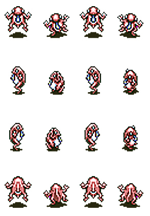

# Sprite Animation

This tutorial will build upon the Using Animations tutorial, which covers sprite sheets, image cells and  animation scripts. For a more detailed overview of these concepts, please visit the Using Animations tutorial as an introduction.

This tutorial involves creating a character sprite and implementing animations for player movement. 

## Sprite Sheet

The following sprite sheet image contains all of the frames needed to create walking animations and static sprites for when the character is standing still.



Save this image to the images folder in your project's resources and make sure it is named `frog.png`

## Animation Script File

An animation script defines the sequence of frames that make up each animation.

SplashKit animation script files consist of three parts. The first is `SplashKit Animation` as a header to identify
the file as an animation script. Next are lines defining the frames of the animations, then identifiers that
give each animation a name to be used in the C++ code.

Comments can also be written in the script file using the same syntax as comments in C++.

Create a new text file (.txt) in the animations folder of your project's resources. Name the file `player_animation.txt`, then write `SplashKit Animation` at the top of the file.

## Defining Animations

Animations are defined by creating sequences of frames that tell the code the order that the frames should be displayed in.
Each individual frame is defined with the syntax `f:ID,cell number,duration,next frame`.

- `f:` indicates that a frame is being defined.
- `ID` is a unique numerical ID for the frame.
- `cell number` is the number that is automatically assigned to the section of the sprite sheet that is used for the frame.
- `duration` is how many game updates the frame is displayed for.
- `next frame` is the ID of the next frame in the sequence.

The cell numbers are assigned from top-left to bottom-right starting at zero.

Using this, we can write the first frame of the walking left animation as `f:0,0,12,1`. This line gives the frame an ID that matches its cell number for simplicity.

The frame is also given a duration, and its next frame is set to the frame with an ID of 1.

If you write similar lines for all four frames of this animation, the animation script file should look like this:

```
SplashKit Animation

//moving forward
f:0,0,12,1
f:1,1,12,2
f:2,2,12,3
f:3,3,12,0
```

In this example, the final frame has a next frame of 0. Setting the last frame to go back to the first frame creates a loop that allows the animation to repeat until the character stops walking.

This code is functional but there is a faster way to create the sequence of frames. As IDs and cell numbers are both in numerical order, and each duration is the same, the sequence can be shortened to one line. The shortening is done by using `[x-y]` as the ID and cell number of a line, which means all numbers from x to y. 

The following example can replace the previous four lines with a single line of code.

```
SplashKit Animation

//moving forward
f:[0-3],[0-3],12,0
```
The following code shows animations for walking in all directions, and single-frame standing animations representing the static images that will display when the character is standing still.

```
SplashKit Animation

//Walking animations
f:[0-3],[0-3],12,0
f:[4-7],[4-7],12,4
f:[8-11],[8-11],12,8
f:[12-15],[12-15],12,12

//Standing single-frame animations
f:16,0,1,
f:17,4,1,
f:18,8,1,
f:19,12,1,
```

The standing animations don't need a next frame as there is only one frame in each animation, so the last number is left blank. The standing animations cannot have IDs that match their cell numbers as the IDs 0 - 15 are already in use. Because of this, the IDs 16 - 19 are used instead.

## Creating Identifiers

The IDs in the script file can be used directly in the C++ code to refer to the animations, but there is a better way.  Assigning meaningful names to these IDs makes the code easier to understand.

This can be achieved in the script file using the syntax `i:name,ID`.

- `i:` indicates that this is an identifier.
- `name` is the name of the animation.
- `ID` is the ID of the first frame of the animation.

These lines can be written anywhere below where their animations are defined. The following code is an example of this, and is the complete code for the animation script.

```
SplashKit Animation

//Walking animations
f:[0-3],[0-3],12,0
f:[4-7],[4-7],12,4
f:[8-11],[8-11],12,8
f:[12-15],[12-15],12,12

//Identifiers
i:WalkFront,0
i:WalkLeft,4
i:WalkRight,8
i:WalkBack,12

//Standing single-frame animations
f:16,0,1,
f:17,4,1,
f:18,8,1,
f:19,12,1,

//Identifiers
i:StandFront,16
i:StandLeft,17
i:StandRight,18
i:StandBack,19
```

## Implementing Animations in C++

Now that the animation script has been created, the C++ code can be updated to use the animations. The first step to doing this is calling the five functions written below to load the resources and set up the animations.

Make sure these function calls are written underneath the line `open_window("Sprite Animation", width, height);` as they must have access an open window.

1. Call the function `load_bitmap(string name, string filename)` to load the sprite sheet file and give it a meaningful name, store the bitmap returned by the function in a variable as shown below:

   ```cpp
   bitmap player_sprites = load_bitmap("FrogBmp", "Frog.png");
   ```

2. Call the function `void bitmap_set_cell_details(bitmap bmp, int width, int height, int columns, int rows, int count)` to divide the sprite sheet into individual cells. The function must be given the following information to know which parts of the sprite sheet are individual sprites.

   - `bmp`: The sprite sheet bitmap.
   - `width`: The width of each cell in pixels, 64 in this case.
   - `height`: The height of each cell in pixels, 64 in this case.
   - `columns`: The number of sprites in each row of the sprite sheet, 9 in this case.
   - `rows`: The number of rows in the sprite sheet, 2 in this case.
   - `count`: The total number of sprites in the sprite sheet, 18 in this case.

   The complete line is as follows:

   ```cpp
   bitmap_set_cell_details(player_sprites, 73, 105, 4, 4, 16);
   ```

3. Call the function `load_animation_script(string name, string filename)` to load the animation script file and store it in a variable, similar to the bitmap.

   ```cpp
   animation_script player_script = load_animation_script("PlayerScript", "player_animations.txt");
   ```

4. Call the function `create_animation(animation_script script, const string &name)` to create a variable to store the current animation and retrieve the first animation that is displayed from the script, StandFront in this case.

   ```cpp
   animation player_animation = create_animation(player_script, "StandFront");
   ```

5. Call the function `option_with_animation(animation anim)` to create a drawing option to be used when drawing the sprite sheet to only draw the current frame of the animation given as the argument.
   ```cpp
   drawing_options opt = option_with_animation(player_animation);
   ```

The start of your main function should now look something like this:

```cpp
// Declare variables for window dimensions
int width = 800;
int height = 600;

// Open a game window with specified title and dimensions
open_window("Sprite Animation", width, height);

// Load player spritesheet and set its cell details
bitmap player_sprites = load_bitmap("FrogBmp", "Frog.png");
bitmap_set_cell_details(player_sprites, 73, 105, 4, 4, 16); // cell width, height, cols, rows, count

// Load the animation script
animation_script player_script = load_animation_script("PlayerScript", "player_animations.txt");

// Create the animation
animation player_animation = create_animation(player_script, "StandFront");

// Create a drawing option
drawing_options opt = option_with_animation(player_animation);

// Declare variables for rectangle dimensions
double w = bitmap_cell_width(player_sprites);
double h = bitmap_cell_height(player_sprites);

// Calculate the position to center the rectangle
double x = width / 2 - w / 2;
double y = height / 2 - h / 2;

// Declare speed of player movement
int speed = 5;
```

As the character is being represented by a different image, the character width and height variables, `w` and `h`, must be updated. This can be achieved by using the following function calls to retrieve the width and height of the sprite cells.

```cpp
double w = bitmap_cell_width(player_sprites);
double h = bitmap_cell_height(player_sprites);
```

## Handling Animations

The final step to implementing animations is to change which animation is displayed when the character's movement direction changes. The animation is changed by calling the function `assign_animation(animation anim, string name)` when the appropriate conditions are met. The function must be given the `player_animation` variable and the identifier name of the animation to be assigned.

If you call `assign_animation` in the player control if statements like the example below, the animation appears to not play when the character is moving.

```cpp
// Player controls
if (key_down(LEFT_KEY) and x > 0)
{
	x -= speed;
	assign_animation(player_animation, "WalkLeft");
}
if (key_down(RIGHT_KEY) and x < width - w)
{
	x += speed;
	assign_animation(player_animation, "WalkRight");
}
if (key_down(UP_KEY) and y > 0)
{
	y -= speed;
	assign_animation(player_animation, "WalkBack");
}
if (key_down(DOWN_KEY) and y < height - h)
{
	y += speed;
	assign_animation(player_animation, "WalkFront");
}
```

This happens because `key_down` returns true on every update that the key is held down on, so the animation restarts on every update. To fix this you must replace the above code with new if statements using `key_typed` instead. The `key_typed` function only returns true for one update at a time even if the key is held down.

Start by creating the following function above `main()` that handles the changing of animations. The function needs access to the animation variable, so it must be passed as an argument.

```cpp
void handle_animations(animation player_animation)
{
}
```

Next, add the following lines inside `handle_animations` to start the walking animations when the character starts walking.

```cpp
if (key_typed(LEFT_KEY)) 
{
    assign_animation(player_animation, "WalkLeft");
}
if (key_typed(RIGHT_KEY)) 
{
    assign_animation(player_animation, "WalkRight");
}
if (key_typed(UP_KEY)) 
{
    assign_animation (player_animation, "WalkBack");
}
if (key_typed(DOWN_KEY)) 
{
    assign_animation(player_animation, "WalkFront"); 
}
```

You also need code to stop the walking animations when the character stops moving. The walk animations can be stopped by using `key_released` to assign the standing animations when the movement keys are released.

```cpp
if (!key_down(LEFT_KEY) and !key_down(RIGHT_KEY) and !key_down(UP_KEY) and !key_down(DOWN_KEY))
{
    if (key_released(LEFT_KEY)) 
    {
        assign_animation(player_animation, "StandLeft");
    }
    if (key_released(RIGHT_KEY)) 
    {
        assign_animation(player_animation, "StandRight");
    }
    if (key_released(UP_KEY)) 
    {
        assign_animation(player_animation, "StandBack");
    }
    if (key_released(DOWN_KEY)) 
    {
        assign_animation(player_animation, "StandFront");
    }
}
```

The outer if statement makes sure that the character is not moving in any direction before assigning a standing animation. The inner if statements choose the appropriate standing animation based on which key was released last.

Finally, a call to the `handle_animations` function, such as the example below, must be added to the main function. The call can be added after the call to `update_animation`

```cpp
handle_animations(player_animation);
```

## Putting it All Together

The following C++ code example combines all the previous steps to create a sprite with walking animations.

```cpp
#include "splashkit.h"

// Function to switch between animations
void handle_animations(animation player_animation)
{
    // Walking animations
    if (key_typed(LEFT_KEY)) 
    {
        assign_animation(player_animation, "WalkLeft");
    }
    if (key_typed(RIGHT_KEY)) 
    {
        assign_animation(player_animation, "WalkRight");
    }
    if (key_typed(UP_KEY)) 
    {
        assign_animation (player_animation, "WalkBack");
    }
    if (key_typed(DOWN_KEY)) 
    {
        assign_animation(player_animation, "WalkFront"); 
    }
    
    // Standing animations
    if (!key_down(LEFT_KEY) and !key_down(RIGHT_KEY) and !key_down(UP_KEY) and !key_down(DOWN_KEY))
    {
        if (key_released(LEFT_KEY)) 
        {
            assign_animation(player_animation, "StandLeft");
        }
        if (key_released(RIGHT_KEY)) 
        {
            assign_animation(player_animation, "StandRight");
        }
        if (key_released(UP_KEY)) 
        {
            assign_animation(player_animation, "StandBack");
        }
        if (key_released(DOWN_KEY)) 
        {
            assign_animation(player_animation, "StandFront");
        }
    }
}

int main()
{
    // Declare variables for window dimensions
    int width = 800;
    int height = 600;

    // Open a game window with specified title and dimensions
    open_window("Sprite Animation", width, height);

    // Load player spritesheet and set its cell details
    bitmap player_sprites = load_bitmap("FrogBmp", "Frog.png");
    bitmap_set_cell_details(player_sprites, 73, 105, 4, 4, 16); // cell width, height, cols, rows, count

    // Load the animation script
    animation_script player_script = load_animation_script("PlayerScript", "player_animations.txt");

    // Create the animation
    animation player_animation = create_animation(player_script, "StandFront");

    // Create a drawing option
    drawing_options opt = option_with_animation(player_animation);

    // Declare variables for rectangle dimensions
    double w = bitmap_cell_width(player_sprites);
    double h = bitmap_cell_height(player_sprites);

    // Calculate the position to center the rectangle
    double x = width / 2 - w / 2;
    double y = height / 2 - h / 2;

    // Declare speed of player movement
    int speed = 5;

    // Basic event loop
    while ( not quit_requested() ) 
    {
        // Draw the bitmap - using opt to link to animation
        clear_screen(COLOR_WHITE);
        draw_bitmap(player_sprites, x, y, opt);
        refresh_screen(60);

        // Update the animation
        update_animation(player_animation);
        handle_animations(player_animation);
        
        process_events();

        // Player controls
        if (key_down(LEFT_KEY) and x > 0)
        {
            x -= speed;
        }
        if (key_down(RIGHT_KEY) and x < width - w)
        {
            x += speed;
        }
        if (key_down(UP_KEY) and y > 0)
        {
            y -= speed;
        }
        if (key_down(DOWN_KEY) and y < height - h)
        {
            y += speed;
        }
    }
}
```

This tutorial has been adapted from the Creating a 2D Metroidvania Game Using Splashkit - Player Character Advanced Tutorial.