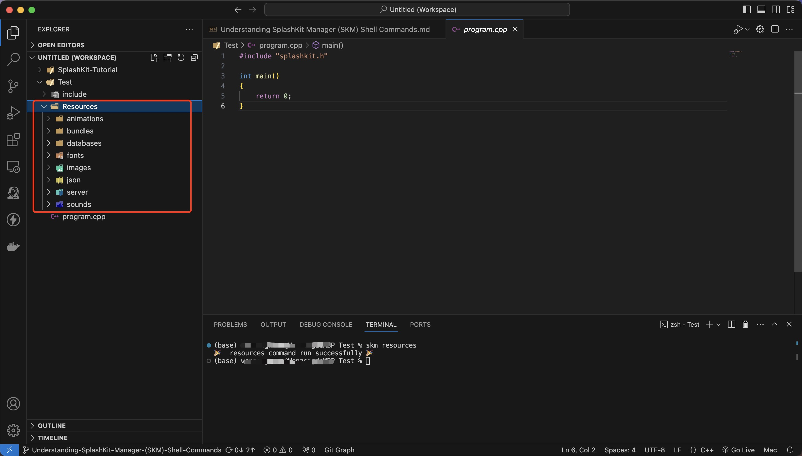
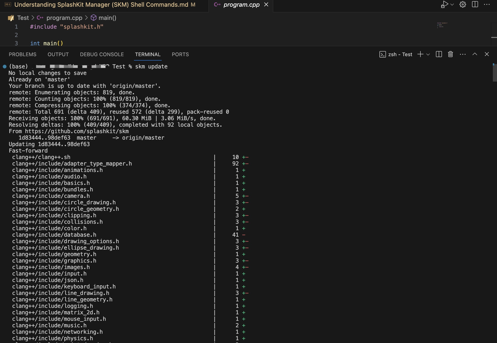
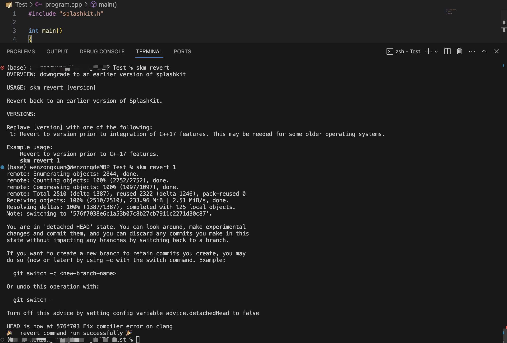
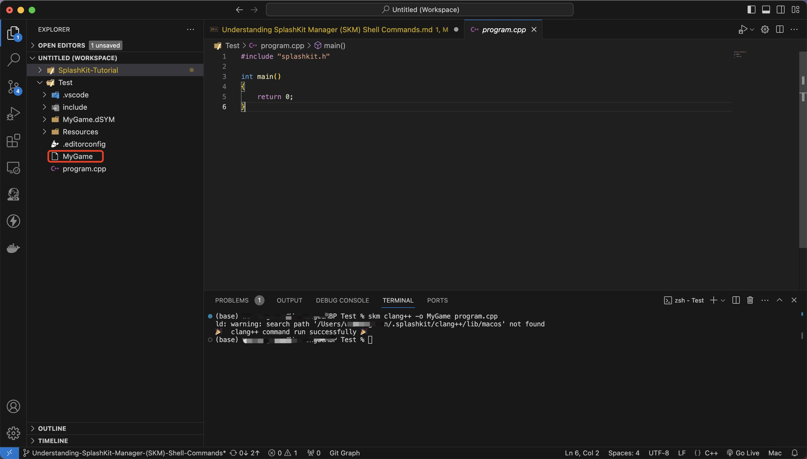
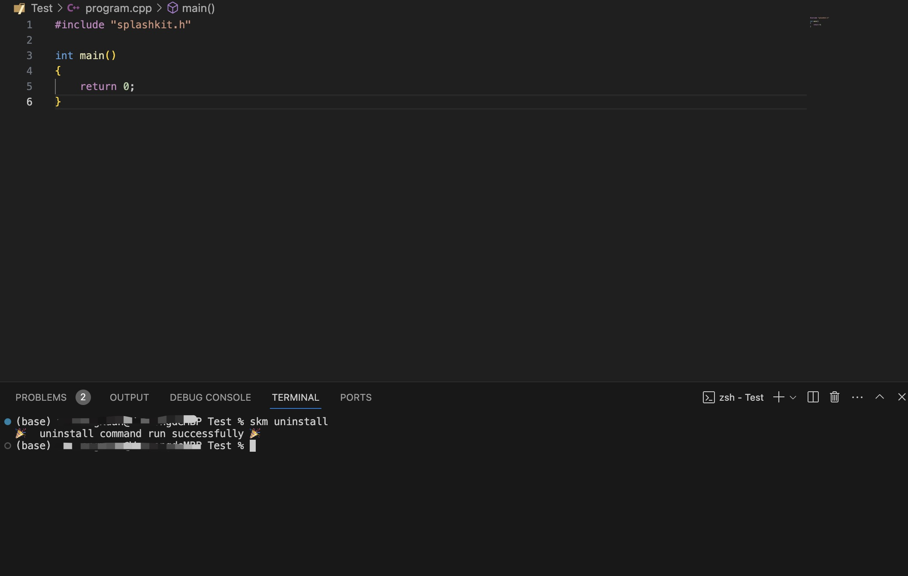

---
title: Understanding SplashKit Manager (SKM) Shell Commands
---

## Introduction

SKM is an invaluable command-line interface (CLI) tool for managing SplashKit projects and resources, pivotal for software development, especially in game development. This tutorial will guide you through each command, providing you with the necessary knowledge to efficiently navigate and utilize the SplashKit Manager, thereby streamlining your development process.

## Prerequisites

Before diving into this tutorial, you should have:

- A basic understanding of programming concepts.
- Familiarity with using the command line interface.
- Some exposure to programming languages like C++, Python, or Pascal is beneficial, though not strictly required.

## Introduction to SplashKit Manager (SKM)

### What is SplashKit Manager (SKM)?

SplashKit Manager, also known as SKM, is a Command Line Interface (CLI) and Graphical User Interface (GUI) tool designed for installing and managing SplashKit. SplashKit is described as a beginner-friendly, all-purpose software toolkit. SKM facilitates the installation and management of SplashKit, along with the creation, building, and running of SplashKit projects.

### Installation and setup

To get started with SKM, follow the installation guide linked in the:
[SKM Installation Documentation](https://splashkit.io/installation/)Ensure you have tools like **curl** and **git** installed on your system for a smooth setup process.

## Working with SKM Commands

### Overview of the SKM Command Structure

SKM commands follow a simple structure: `skm [command] [arguments]`. This structure is designed to provide intuitive access to a wide range of functionalities, from project creation to compiler management.

### Basic Usage

The fundamental usage pattern of SKM is straightforward: initiate the command with `skm`, followed by the specific action you want to perform, and any necessary arguments.

### Understanding SKM Commands

Let's delve into the newly introduced commands, providing a detailed explanation, usage examples, and common use cases for each.

#### The `resources` Command

- **Function**: Creates or manages the resources folder for a project.
- **Usage**: `skm resources`
- **Example**: Before adding images or sound files to your project, use this command to ensure the resources folder is properly set up.
- **Use Cases**: Organizing and accessing project assets like images, sounds, and other media.

#### Version Management Commands (`update`, `revert`)

- **Function**: Manages SplashKit library versions.
- **Usage**:
    `skm update` for updating to the latest version.
    `skm revert` for rolling back to a previous version.
- **Examples**:
    `skm update` to access new features or bug fixes.
    `skm revert` if the latest version causes issues with your project.
- **Use Cases**: Keeping your development environment up-to-date or ensuring compatibility with project dependencies.

#### The `clang++` and `g++` Command

- **Function**: Compile C++ projects using the `clang++` or `g++` compilers.
- **Usage**: `skm clang++ [options] [source files]` or `skm g++ [options] [source files]`
- **Example**: `skm clang++ -o MyGame main.cpp` or `skm g++ -o MyGame main.cpp` would compile a source file named `main.cpp` and produce an executable named MyGame..
- **Use Cases**: Quickly starting work on an existing SplashKit project by setting up all its dependencies with a single command.

#### The `uninstall` Command

- **Function**: Removes SKM and SplashKit from your system.
- **Usage**: `skm uninstall`
- **Example**: `skm uninstall` when you no longer need SplashKit installed on your machine.
- **Use Cases**: Ideal for compiling C++ projects with SplashKit libraries, allowing developers to create executable games or applications directly from the command line.

## Integration with IDEs and Build Systems

Seamlessly integrating SKM with your preferred Integrated Development Environment (IDE) and build systems enhances your productivity. This tutorial covers practical steps for setting up SKM with popular IDEs such as Visual Studio Code, and demonstrates how to incorporate SKM commands into your build processes, ensuring a smooth development workflow.
